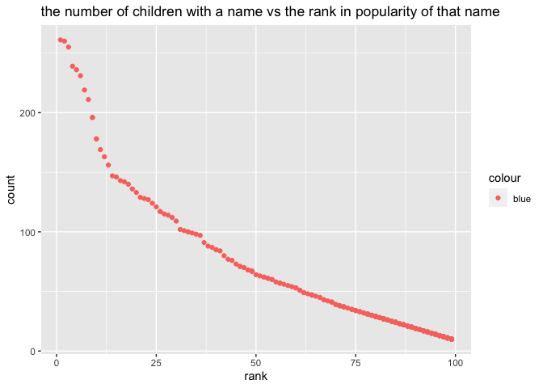

p8105\_hw2\_WZ2591
================
Wenyu Zhang
10/5/2021

``` r
library(tidyverse)
```

    ## ── Attaching packages ─────────────────────────────────────── tidyverse 1.3.1 ──

    ## ✓ ggplot2 3.3.5     ✓ purrr   0.3.4
    ## ✓ tibble  3.1.4     ✓ dplyr   1.0.7
    ## ✓ tidyr   1.1.3     ✓ stringr 1.4.0
    ## ✓ readr   2.0.1     ✓ forcats 0.5.1

    ## ── Conflicts ────────────────────────────────────────── tidyverse_conflicts() ──
    ## x dplyr::filter() masks stats::filter()
    ## x dplyr::lag()    masks stats::lag()

``` r
library(readxl)
library(dplyr)
```

# Problem 1

## Read and clean the Mr. Trash Wheel sheet:

1.  specify the sheet in the Excel file and to omit non-data entries
    (rows with notes / figures; columns containing notes) using
    arguments in read\_excel

2.  use reasonable variable names

3.  omit rows that do not include dumpster-specific data

4.  round the number of sports balls to the nearest integer

``` r
mr_trash_wheel = 
  read_excel("data/Trash-Wheel-Collection-Totals-7-2020-2.xlsx", range = "A2:N535") %>% 
  janitor::clean_names() %>% 
  rename(weight = weight_tons, volume = volume_cubic_yards) %>% 
  filter(!is.na(dumpster), dumpster != "Grand Total") %>%
  mutate(sports_balls = as.integer(round(sports_balls)))
```

## Read and clean precipitation data for 2018 and 2019:

``` r
trash_wheel_precipitation_2018 = 
  read_excel("data/Trash-Wheel-Collection-Totals-7-2020-2.xlsx", sheet = 7, range = "A2:B14") %>%
  janitor::clean_names() %>%
  rename(total_precipitation = total) %>%
  filter(!is.na(total_precipitation)) %>%
  mutate(year = 2018, 
         month = month.name[month]) %>%
  relocate(year)
```

``` r
trash_wheel_precipitation_2019 = 
  read_excel("data/Trash-Wheel-Collection-Totals-7-2020-2.xlsx", sheet = 6, range = "A2:B14") %>%
  janitor::clean_names() %>%
  rename(total_precipitation = total) %>%
  drop_na(total_precipitation) %>% 
  mutate(year = 2019, 
         month = month.name[month]) %>% 
  relocate(year)
```

``` r
# Combine precipitation datasets for 2018 and 2019
trash_wheel_precipitation_2018_2019 = 
  bind_rows(trash_wheel_precipitation_2018, trash_wheel_precipitation_2019)

trash_wheel_precipitation_2018_2019
```

    ## # A tibble: 24 × 3
    ##     year month     total_precipitation
    ##    <dbl> <chr>                   <dbl>
    ##  1  2018 January                  0.94
    ##  2  2018 February                 4.8 
    ##  3  2018 March                    2.69
    ##  4  2018 April                    4.69
    ##  5  2018 May                      9.27
    ##  6  2018 June                     4.77
    ##  7  2018 July                    10.2 
    ##  8  2018 August                   6.45
    ##  9  2018 September               10.5 
    ## 10  2018 October                  2.12
    ## # … with 14 more rows

## Write a paragraph about these data

For “mr\_trash\_wheel\_data”, there are 453 rows and 14 columns with 14
variables: dumpster, month, year, date, weight, volume,
plastic\_bottles, polystyrene, cigarette\_butts, glass\_bottles,
grocery\_bags, chip\_bags, sports\_balls and homes\_powered.

For “trash\_wheel\_precipitation\_2018\_2019” data, there are 24 rows
and 3 columns with 3 variables: month, year and total\_precipitation

For available data, what was the total precipitation in 2018? What was
the median number of sports balls in a dumpster in 2019?

``` r
# The total precipitation in 2018
sum(pull(trash_wheel_precipitation_2018,total_precipitation))
```

    ## [1] 70.33

``` r
# The median number of sports balls in a dumpster in 2019
balls_in_2019 = filter(mr_trash_wheel, year == "2019")
median(pull(balls_in_2019, sports_balls))
```

    ## [1] 9

The total precipitation in 201 is 70.33, and the median number of sports
balls in a dumpster in 2019 is 9

# Problem 2

## First, clean the data in pols-month.csv.

1.  Use separate() to break up the variable mon into integer variables
    year, month, and day

2.  replace month number with month name

3.  create a president variable taking values gop and dem, and remove
    prez\_dem and prez\_gop

4.  remove the day variable.

``` r
pols_month_df = 
  read_csv("data/fivethirtyeight_datasets/pols-month.csv") %>%   
  janitor::clean_names() %>%
  separate(mon, into = c("year", "month", "day"), sep = "-") %>%
  mutate(month = month.name[as.numeric(month)], 
         year = as.numeric(year)) %>% 
  mutate(president = if_else(prez_gop == 0, "democreatic", "republican")) %>%
  select(-prez_dem, -prez_gop, -day)
```

## Second, clean the data in snp.csv using a similar process to the above.

For consistency across datasets, arrange according to year and month,
and organize so that year and month are the leading columns.

``` r
snp_df = 
  read_csv("data/fivethirtyeight_datasets/snp.csv") %>% 
  janitor::clean_names() %>% 
  mutate(date = lubridate::mdy(date)) %>% 
  separate(date, into = c("year", "month", "day"), sep = "-") %>%
  arrange(year, month) %>% 
  mutate(month = month.name[as.numeric(month)], 
         year = as.numeric(year)) %>%
  select(-day) 
```

## Third, tidy the unemployment data so that it can be merged with the previous datasets.

This process will involve switching from “wide” to “long” format;
ensuring that key variables have the same name; and ensuring that key
variables take the same values.

``` r
unemployment_df = 
  read_csv("data/fivethirtyeight_datasets/unemployment.csv") %>%
  rename(year = Year) %>% 
  pivot_longer(
    Jan:Dec,
    names_to = "month",
    values_to = "unemployment") %>%
  mutate(month = month.name[match(month,month.abb)])
```

## Join the datasets by merging snp into pols, and merging unemployment into the result.

``` r
pols_snp = 
  left_join(pols_month_df, snp_df, by = c("year", "month"))
pols_snp_unemployment = 
  left_join(pols_snp, unemployment_df, by = c("year", "month"))
```

## Write a short paragraph about these datasets

For describe pols\_month\_df data, the dimension of data is 822, 9, the
range of years is 1947, 2015 and names of key variables are year, month,
gov\_gop, sen\_gop, rep\_gop, gov\_dem, sen\_dem, rep\_dem, president

For describe snp\_df data, the dimension of data is 787, 3, the range of
years is 1969, 2068 and names of key variables are year, month, close

For describe unemployment\_df data, the dimension of data is 816, 3, the
range of years is 1948, 2015 and names of key variables are year, month,
unemployment

For describe pols\_snp\_unemployment data, the dimension of data is 822,
11, the range of years is 1947, 2015 and names of key variables are
year, month, gov\_gop, sen\_gop, rep\_gop, gov\_dem, sen\_dem, rep\_dem,
president, close, unemployment

# Problem 3

## Load and tidy the data.

``` r
popular_names = 
  read_csv("data/Popular_Baby_Names.csv") %>% 
  janitor::clean_names() %>%
  mutate(ethnicity = 
           recode(ethnicity, 
                            "ASIAN AND PACI" = "ASIAN AND PACIFIC ISLANDER", 
                            "BLACK NON HISP" = "BLACK NON HISPANIC", 
                            "WHITE NON HISP" = "WHITE NON HISPANIC")) %>%
  mutate(
    childs_first_name = toupper(childs_first_name), 
    gender = toupper(gender), 
    ethnicity = toupper(ethnicity)) %>%
  distinct()
```

## Produce a well-structured, reader-friendly table

Showing the rank in popularity of the name “Olivia” as a female baby
name over time; this should have rows for ethnicities and columns for
year.

``` r
rank_olivia = 
  popular_names %>% 
  filter(childs_first_name %in% c("OLIVIA"), gender %in% c("FEMALE")) %>%
  select(-count,-childs_first_name,-gender) %>%
  pivot_wider(
              names_from = year_of_birth, 
              values_from = rank) %>%
  knitr::kable()
```

Produce a similar table showing the most popular name among male
children over time.

``` r
popular_male = 
  popular_names %>%
  filter(gender %in% c("MALE"), rank == "1") %>%
  select(-count,-rank,-gender) %>% 
  pivot_wider(
              names_from = year_of_birth, 
              values_from = childs_first_name) %>%
  knitr::kable()
```

## Finally, for male, white non-hispanic children born in 2016, produce a scatter plot showing the number of children with a name (y axis) against the rank in popularity of that name (x axis).

``` r
non_hispanic_2016 = 
  popular_names %>%
  filter(ethnicity %in% c("WHITE NON HISPANIC"), gender %in% c("MALE"), year_of_birth %in% c("2016") )

scatter_plot = 
  non_hispanic_2016 %>% 
  ggplot(aes(x = rank, y = count, color = "blue")) + 
  geom_point() +
  labs(title = "the number of children with a name vs the rank in popularity of that name") 

scatter_plot
```

<!-- -->
